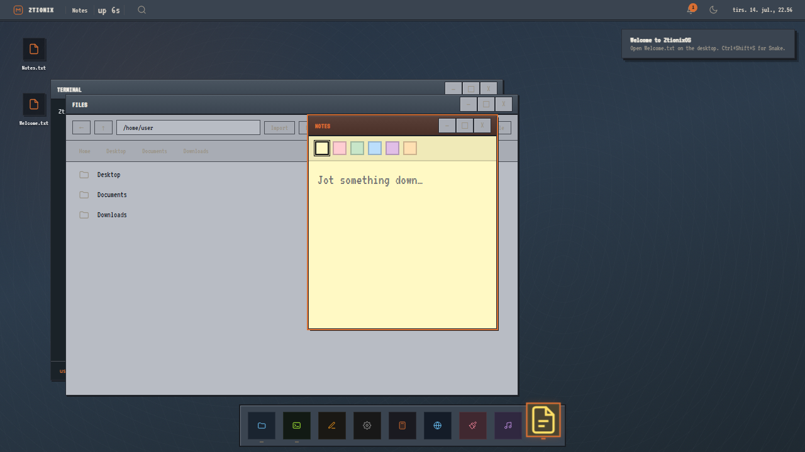

# ZtionixOS

A fake desktop that runs in the browser: boot screen, draggable windows, a real filesystem, and a bunch of small apps I wrote myself.



**[Open the live demo](https://ztionix-os.vercel.app/)** - click Enter on login. No password.

## Quick start

Open the link above. Wait for boot, hit Enter, double-click Welcome.txt if you want a tour. That's the whole web version.

## What you can actually do

- Move windows around (drag uses GPU transforms now, not the old left/top spam)
- Save files in a virtual `/home/user` tree (IndexedDB, survives refresh)
- Open Files, Terminal, Editor, Paint, ZMusic, Notes, Snake, Calculator, Browser, Settings
- Drag files onto the desktop to import them
- Toggle a little desktop pet from the right-click menu or Settings
- Hit the Konami code for party mode. Triple-click the logo for CRT scanlines. Ctrl+Shift+S opens Snake.

## Run it locally

Node 18+.

```bash
git clone https://github.com/Ander507/ZtionixOS.git
cd ZtionixOS
npm install
npm run dev
```

Go to `http://localhost:5173`.

```bash
npm run build
npm test
```

## How I built it

No React. The kernel mounts a shell (topbar, desktop, window layer, dock) and apps return plain DOM nodes. Window dragging went through a rewrite: pointer move applies `translate3d`, commit on mouseup, then snap logic runs. Felt smoother than updating `style.left` every frame.

The VFS lives in IndexedDB. Text is UTF-8, binaries base64. Terminal `open` and double-click share the same file routing.

I removed the chat app. It needed Redis on Vercel and felt bolted-on. Everything else is client-side.

## AI usage

I used Cursor (Claude) on parts of this project. Not the whole thing — the idea, architecture, and most of the app logic are mine. AI helped where I got stuck or wanted to move faster.

**I wrote myself (no AI drafting the core):**
- The fake-OS concept and how apps plug into the kernel
- VFS / IndexedDB filesystem and file routing
- Window manager behavior (focus, snap, minimize, resize)
- Most app logic: Files, Terminal, Editor, Paint, ZMusic, Settings, Browser
- Boot flow, login, dock, desktop icons, shortcuts

**AI assisted (I reviewed and edited everything):**
- CSS pass for the retro look (palette, VT323, square windows, scrollbars)
- README wording and structure
- Some easter eggs: party mode, CRT toggle, Snake, Notes, desktop pet, calculator `67` secret
- Window drag rewrite (`translate3d` during drag, commit on mouseup)
- Debugging (browser iframe layout, Notes contrast, pet default off)
- Occasional refactors and comments when cleaning up "too AI" looking code

**Rough estimate:** ~25% of the current codebase by line count had meaningful AI help mostly styling, and the fun extras above. Core shell and apps are mostly hand-written. WakaTime and git history are on my account if reviewers want to check.

If something looks templated, call it out. Happy to walk through any file.

## Shortcuts

Ctrl+K launcher · Ctrl+L lock · Ctrl+, settings · Ctrl+Shift+S snake · Alt+Tab cycle windows · Delete remove desktop icons · F2 rename

## Credits

Built by [Ander507](https://github.com/Ander507) for [Hack Club](https://hackclub.com/).

Fonts: VT323. Bundler: Vite. Tests: Vitest.
